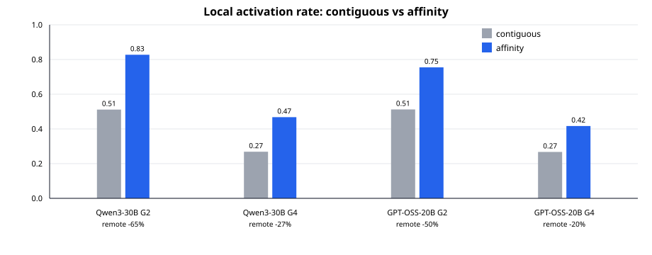

# Results: Intra-node Semantic-Parallelism Pattern

Date: 2026-06-24

## Question

Can our current MoE routing traces show the same intra-node pattern as
Speculative MoE / Semantic Parallelism: higher local activation rate after
affinity-aware expert placement and request scheduling?

## Result

Yes at the routing/communication-volume level. Affinity placement plus oracle
request-to-group scheduling consistently increases LAR over contiguous placement
and cuts the remote-volume proxy `(1 - LAR)`.

| Model | Groups | Contig LAR | Affinity LAR | LAR gain | Remote-volume reduction | All-step acc | Draftable frac | Draftable acc |
| --- | ---: | ---: | ---: | ---: | ---: | ---: | ---: | ---: |
| Qwen3-30B-A3B | 2 | 0.511 | 0.827 | 61.8% | 64.6% | 0.858 | 36.1% | 0.869 |
| Qwen3-30B-A3B | 4 | 0.269 | 0.468 | 74.1% | 27.2% | 0.454 | 0.0% | - |
| GPT-OSS-20B | 2 | 0.512 | 0.755 | 47.4% | 49.7% | 0.840 | 19.9% | 0.888 |
| GPT-OSS-20B | 4 | 0.267 | 0.417 | 56.0% | 20.4% | 0.590 | 0.0% | - |

## Reading

**G=2 reproduces the paper-like intra-node pattern strongly.** Qwen3 raises LAR
from 0.511 to 0.827, cutting
remote volume by 64.6%. GPT-OSS raises LAR
from 0.512 to 0.755, cutting
remote volume by 49.7%. This is the same
qualitative shape as the paper's intra-node result: better semantic grouping
turns remote expert routing into local expert routing.

**G=4 still improves locality but is no longer enough for a useful draft.** LAR
improves for both models, but the absolute LAR remains below 0.5 and no step
crosses the Phase 13 draftable threshold (`coverage >= 0.9`). The local-draft
acceptance proxy is also much lower: Qwen3 0.454
and GPT-OSS 0.590.

**This phase is not an end-to-end speedup claim.** The output is a locality and
remote-volume proxy derived from Phase 13 traces. Phase 12 already showed that
single-node NVLink EP-width changes move vLLM decode latency only slightly, so
large end-to-end gains are unlikely without an explicit communication kernel
microbenchmark or a slower/heterogeneous intra-node fabric.

## Conclusion

It is not hard to show the same *pattern* as the paper: our traces already show
that affinity/request-aware scheduling increases LAR and reduces remote routing,
especially at `G=2`. It is hard to show a strong end-to-end speedup on this
single NVLink node, because the intra-node all-to-all is too cheap relative to
full decode compute.

## Next step

Run a controlled intra-node all-to-all/all-to-allv microbenchmark where LAR is
swept from contiguous-like to affinity-like values. That would convert this
volume proxy into the latency-vs-LAR curve needed to mirror the paper's Figure 5
more directly.
